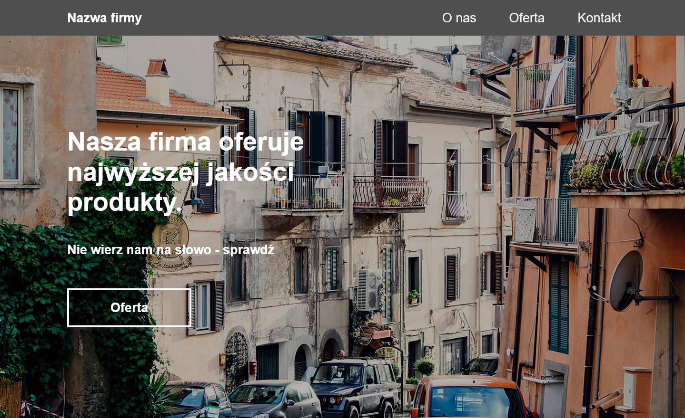

# FC-HTML-CSS_1

The final project of the HTML/CSS module of the Future Collars Bootcamp

## Table of contents

- [Overview](#overview)
  - [The challenge](#the-challenge)
  - [Screenshot](#screenshot)
  - [Links](#links)
- [My process](#my-process)
  - [Built with](#built-with)
  - [What I learned](#what-i-learned)
  - [Continued development](#continued-development)
  - [Useful resources](#useful-resources)
- [Author](#author)

## Overview

Project is based on Figma project design provided by Future Collars

### The challenge

Users should be able to:

- View the optimal layout depending on their device's screen size
- See hover and focus states for interactive elements
- See smooth scroll animation after clicking the links

### Screenshot



### Links

- Source code URL: [https://github.com/sudawiec/FC-HTML-CSS_1](https://github.com/sudawiec/FC-HTML-CSS_1)
- Live site URL: [https://fabulous-nasturtium-720f96.netlify.app](https://fabulous-nasturtium-720f96.netlify.app)

## My process

### Built with

- Semantic HTML markup
- Flexbox
- Mobile-first workflow
- CSS custom properties(variables)

### What I learned

- Usage of the :nth-of-type() selector with (odd) and (even) keywords

```css
.person:nth-of-type(odd) {
  margin-bottom: 2.33em;
}
.person:nth-of-type(even) {
  flex-direction: row-reverse;
}
```

- CSS transitions which allows me to change property values smoothly, over a given duration

```css
.box {
  transition: all 0.5s ease;
}
```

- The transform property which let me rotate, scale, skew, and translate an element

```css
.box:hover {
  transform: scale(1.05);
}
```

### Continued development

The next step I'm going to focus on:

- Creating a hamburger menu button
- Learning more about cubic-bezier() function

### Useful resources

- [MDN Web Docs](https://developer.mozilla.org/en-US/) - Great and irreplaceable resource of knowledge
- [W3Schools](https://www.w3schools.com/) - Great and irreplaceable resource of knowledge
- [CSS-Tricks](https://css-tricks.com/) - They have handy solutions with nice graphic design

## Author

- Radosław Warakomski - [sudawiec](https://github.com/sudawiec)
